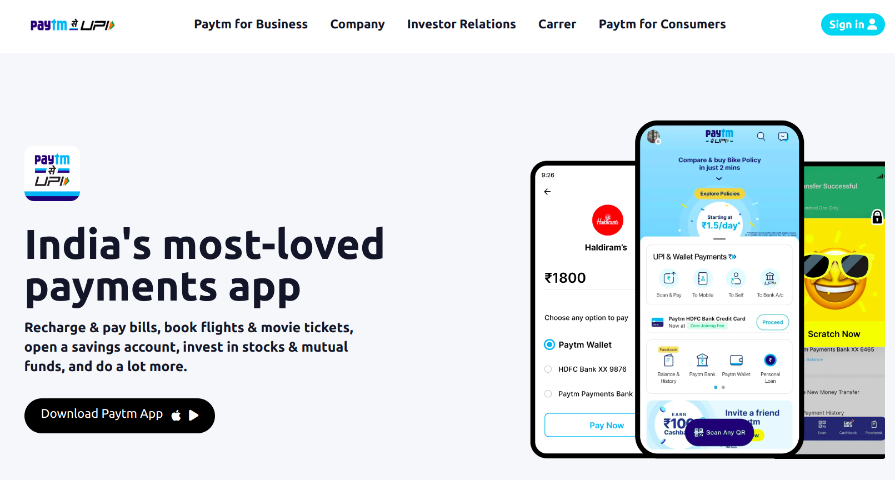

# Paytm - Clone

**Technology Used**: tailwindcss

**TimeTaken**: 8 hours

**Description**: This is the 16th project of Fullstack JS bootcamp to familiarize with tailwindcss and responsive layouts.  
 

  

> **Deployed Link**:  https://paytm-clone-hameed.netlify.app

 

Connect me on [LinkedIn](https://www.linkedin.com/in/hameed-asmath-973462191) and Take a look on my [FindCoder](https://www.findcoder.io/u/hameed) Profile.

